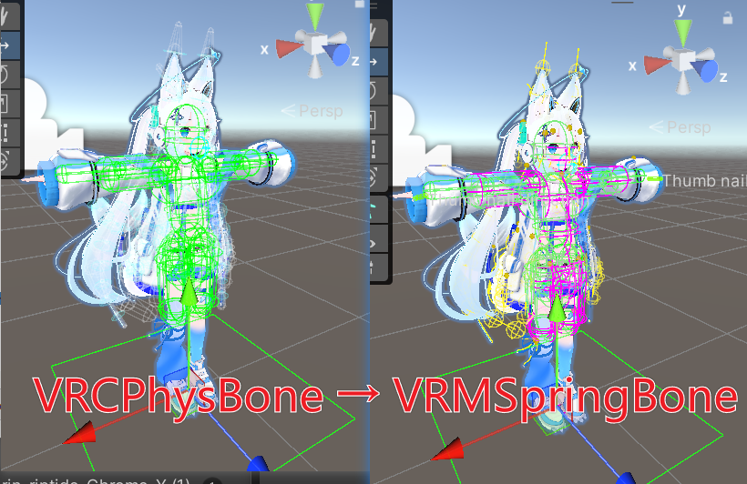

# Avatar PhysBone Converter



[](https://github.com/ccd775/PhysBone2SpringBone/actions/workflows/validate-package.yml)
[](https://github.com/ccd775/PhysBone2SpringBone/releases/latest)
[](LICENSE.md)

将 VRC PhysBone 高保真转换为 VRM 1.0 SpringBone，并将转换后的头像 Prefab 导出为 VRM 1.0 `.vrm`。

## 功能

- 使用 VRC 实际初始化后的 PhysBone 拓扑，而不是只猜测 Transform 层级。
- 按关节采样 Pull、Spring、Stiffness、Gravity、Gravity Falloff、Immobile、Radius 与曲线。
- 保留原骨骼层级；分支按 VRM 线性 Spring 规则拆分，必要时只生成尾端 Transform。
- 转换 Sphere、Capsule、Inside Sphere/Capsule 与 Plane Collider。
- 只绑定源 PhysBone 显式引用的 ColliderGroup，保留 Collider–Spring 碰撞关系。
- 将 Angle、Hinge、Polar 限制映射到 UniVRM 的 `VRMC_springBone_limit` 扩展。
- 分析面板显示 PhysBone、Spring、动态骨骼、模拟段、Collider、显式引用、警告与错误总数。
- 默认保留并禁用源组件，可重复重建，也可安全移除本工具生成的数据。
- 只转换当前启用且位于 active 层级中的 PhysBone/Collider，与 UniVRM 实际导出的头像状态一致。
- 保存独立、非 Variant 的转换 Prefab及其专用 `VRM10Object`，并直接打开 UniVRM 的 VRM 1.0 导出面板生成 `.vrm`。

## 环境要求

- Unity 2022.3 LTS
- VRChat SDK - Avatars 3.10.3 或兼容的新版本
- UniVRM 0.131.2：`com.vrmc.gltf` 与 `com.vrmc.vrm` 必须来自同一版本

VRChat SDK 不随本工具分发，请先通过 VRChat Creator Companion 安装 Avatar SDK。

## 安装

### 推荐：包含 UniVRM 的一键 `.unitypackage`

如果项目尚未安装 UniVRM：

1. 从 [v2.3.0 Release](https://github.com/ccd775/PhysBone2SpringBone/releases/tag/v2.3.0) 下载 `AvatarPhysBoneConverter-v2.3.0-With-UniVRM-0.131.2.unitypackage`。
2. 双击文件，或在 Unity 使用 **Assets > Import Package > Custom Package...**。
3. 保持全部文件勾选并导入。该安装包会同时导入本工具与官方 UniVRM 0.131.2 的 `com.vrmc.gltf`、`com.vrmc.vrm`。

该包不包含 UniVRM Samples，也不包含 VRM 0.x 包。

### 已安装 UniVRM：仅工具 `.unitypackage`

已有完整 UniVRM 0.131.2 时，可下载较小的 `AvatarPhysBoneConverter-v2.3.0.unitypackage`，避免覆盖现有 UniVRM。

### Git URL / UPM

UPM 安装不会自动解析 UniVRM 的 unitypackage 布局，因此请先安装完整 UniVRM 0.131.2，再使用：

```text
https://github.com/ccd775/PhysBone2SpringBone.git#v2.3.0
```

## 使用

1. 打开 **Tools > Avatar > PhysBone to VRM 1 SpringBone**。
2. 把场景中的头像根 `Animator` 拖到 **Avatar Animator**。
3. 点击 **分析转换质量与兼容性**，检查阻断错误与格式差异警告。
4. 点击 **转换为 VRM 1.0 SpringBone**。
5. 在 **Prefab / VRM 1.0 导出** 区域保存转换后的 Prefab。
6. 以该 Prefab 为导出目标，打开 UniVRM VRM 1.0 导出面板，补齐并确认 Meta、Mesh、Export Settings 后导出 `.vrm`。

默认生成的 `VRM10Object` 与 Prefab 位于 `Assets/PhysBone2SpringBoneGenerated`，不会写入安装包目录。

## Collider 与扩展

- Sphere 与 Capsule 使用标准 VRM 1.0 SpringBone Collider 数据。
- Inside Sphere/Capsule 与 Plane 使用 `VRMC_springBone_extended_collider`；Plane 同时带标准 Sphere fallback。
- Angle/Hinge/Polar 使用 `VRMC_springBone_limit`。
- 不支持扩展的查看器不会获得 Inside、无限 Plane 或角度限制语义。
- `.vrm` 中 ColliderGroup 没有 Transform 归属；Collider 节点和 Spring→Group→Collider 引用仍会保留。

## 无法等价转换的功能

VRM SpringBone 与 VRC PhysBone 是不同求解器，以下能力没有格式级一一对应：

- 玩家手部、世界或全局碰撞权限；只能保留显式 Collider 引用。
- Grab、Pose、Snap To Hand 与权限过滤。
- Stretch/Squish 和 PhysBone 动画参数。
- 每帧由动画改变的 rest pose。
- 部分或逐关节 Immobile。工具仅对整条链完全 Immobile 的情况设置 VRM Center，其余情况优先保留世界空间惯性。

转换器会在分析报告中明确列出这些差异，不会静默伪造支持。

## 安全与回滚

- 建议保留默认选项：源 PhysBone/Collider 会被禁用而不是删除。
- “删除源组件”会删除头像层级下全部 VRC PhysBone/Collider，且此后不能安全重建或移除转换结果；只应对已备份副本使用。
- 场景组件的转换和移除支持 Unity Undo；新建的 `VRM10Object`、Prefab 与 `.vrm` 是持久资产，不会随场景 Undo 自动删除。
- Converter 禁止直接修改 Project Prefab、Prefab Mode、`LoadPrefabContents` 与 Preview Scene。

## 代码命名

- 命名空间：`ccd775.AvatarPhysBoneConverter`
- Runtime 程序集：`ccd775.AvatarPhysBoneConverter`
- Editor 程序集：`ccd775.AvatarPhysBoneConverter.Editor`
- UPM package id：`com.ccd775.avatar-physbone-converter`

## 许可证与第三方组件

本工具源码使用 [MIT License](LICENSE.md)。包含 UniVRM 的 Release 安装包会原样附带官方 UniVRM 0.131.2 及其许可证文件；来源、版本与校验值见 [NOTICE.md](NOTICE.md)。VRChat SDK 不随包分发。

本项目是社区 PhysBone2SpringBone 工具的彻底重写版。VRM 与 VRChat 商标及第三方许可说明见 [NOTICE.md](NOTICE.md)。
